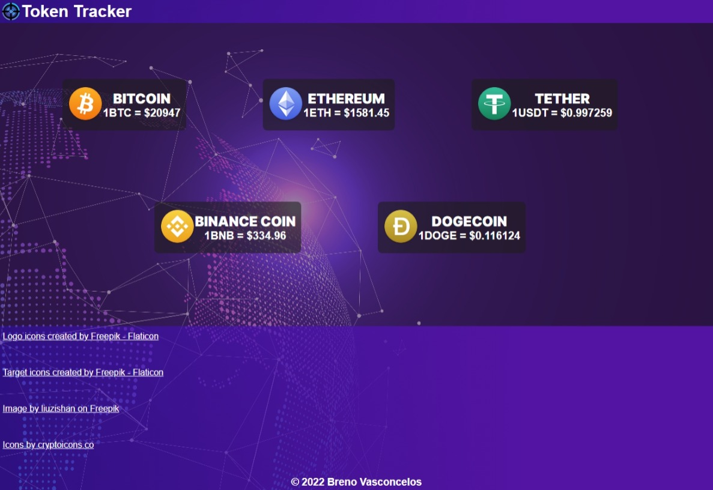

# TOKEN TRACKER

Projeto desenvolvido com o objetivo de usar uma API para receber valores de algumas criptomoedas em tempo real. Para o projeto, foi utilizada a API da CoinGecko.

[🔗Clique aqui para acessar](https://brevsc.github.io/tokentracker)

## 💻 Tecnologias

- HTML
- CSS
- JavaScript
- Git e Github

## 📱 Contato

theyukidjr@gmail.com
